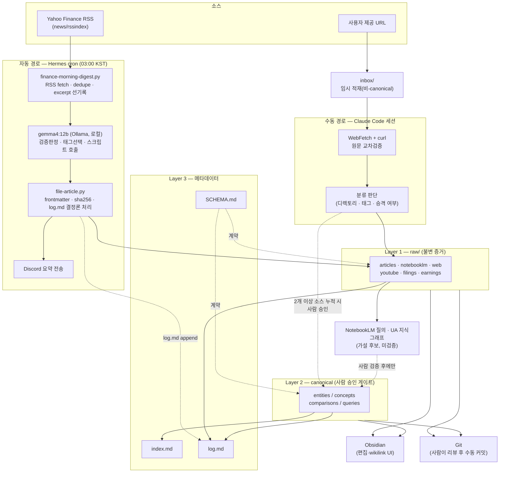

# 현재 시스템 구조 및 데이터 플로우 분석

**작성일**: 2026-08-01
**작성자**: Claude Code Analysis
**목적**: `.claude/CLAUDE.md` 가이드라인에 따라 `2nd-brain-system`의 docs 전체
(`AGENTS.md`, `SCHEMA.md`, `README.md`, `index.md`, `log.md`, `docs/*.md`,
`docs/architecture/`)를 분석하고, **실측된 현재 상태 기준**으로 데이터 플로우와
시스템 구조도를 기록한다. `docs/architecture/second-brain-pkm-architecture.md`가
목표/설계 아키텍처 문서라면, 이 문서는 2026-08-01 기준 **실제 운영 중인 상태**의
스냅샷이다.

---

## 1. 개요

- **프로젝트 정체성**: 코드가 아닌 Markdown 기반 증거 우선(evidence-first) 개인
  지식관리(PKM) 위키. DB/빌드 시스템 없음, 저장소 루트가 곧 위키 루트.
- **권위 계약**: `SCHEMA.md`가 데이터 계약의 유일한 근거이며 `README.md`(PARA
  예시)보다 우선한다. `AGENTS.md`는 에이전트용 요약 오리엔테이션이다.
- **3계층 구조** (`SCHEMA.md`):
  1. `raw/` — 불변 원본 증거 (SHA-256 무결성)
  2. `entities/`, `concepts/`, `comparisons/`, `queries/` — canonical 지식
  3. `SCHEMA.md` / `index.md` / `log.md` — 계약·카탈로그·이력
- 2026-07-21에 PKM/AI 워크플로우 도메인으로 초기 구축되었고, 2026-07-31부터
  **finance 도메인**이 스키마 확장 + 무인 자동 수집(Hermes cron)으로 추가되는
  중이다. 이 문서가 다루는 것은 주로 이 finance 자동화 경로다.

## 2. 현재 데이터 플로우 (실측, 2026-08-01 기준)

두 개의 독립된 캡처 경로가 같은 3계층 저장소를 공유한다.

### 2.1 수동 경로 — Claude Code 세션

```
사용자 입력(URL 등)
  → inbox/ 임시 적재
  → 원문 대조 검증 (WebFetch 요약 vs curl 원본 HTML)
  → 분류 판단 (raw 하위 디렉토리 + 태그 + canonical 승격 여부)
  → raw/<kind>/*.md 생성 (frontmatter + sha256, inbox 파일 삭제)
  → log.md에 ingest 항목 append
  → (동일 주제가 raw 소스 2건 이상 누적되거나 단일 소스의 중심 주제일 때만)
    entities|concepts|comparisons|queries/*.md 생성·갱신
  → index.md + log.md를 canonical 변경과 같은 트랜잭션으로 동기화
```

실측 사례: `docs/dev-log/260731_03_inbox-classification-test.md`의 Korean-stocks 기사
1건 — canonical 승격은 소스 1건이라 보류되고 raw까지만 진행됨.

### 2.2 자동 경로 — Hermes cron (`finance-morning-digest`, 매일 03:00 KST)

```
Yahoo Finance RSS (curl, 브라우저 UA)
  → finance-morning-digest.py (--script, 결정론적)
      · raw/articles/ 기존 source와 대조해 중복 제거 (24h 컷오프)
      · 기사별 og:description/JSON-LD에서 teaser·author 추출
      · 기사별 body 파일을 /tmp/finance_digest_bodies/*.md에 선(先)기록
      · {title, link, published, excerpt, author, body_file} JSON을
        에이전트 프롬프트에 주입
  → Hermes 에이전트 (로컬 Ollama gemma4:12b) — 판단만 수행
      · 검증됨/미검증 판정, 태그 선택
      · file-article.py 호출 (본문·frontmatter 직접 작성 금지)
  → file-article.py (결정론적)
      · 등록 태그 검증(ERROR 시 거부), sha256 계산, YAML frontmatter 작성
      · body_file ↔ --link URL 일치성 검사(교차오염 가드)
      · raw/articles/*.md 생성 + log.md ingest 항목 append
  → Discord로 요약(건수/제목/태그/3문장 요약) 전송
  → git add/commit은 하지 않음 — 사람이 리뷰 후 수동 커밋
```

canonical 페이지(`entities/` 등)는 이 경로에서 **의도적으로 생성되지 않는다** —
다중 소스 판단과 wikilink 연결성 확보는 사람의 몫으로 남겨둠
(`docs/dev-log/260731_04_hermes-finance-cron-setup.md` §5).

## 3. 시스템 구조도



## 4. 현재 상태 스냅샷 (실측, 2026-08-01)

| 구분 | 세부 | 개수 |
| --- | --- | --- |
| raw/articles | 뉴스·기사 | 3 |
| raw/notebooklm | NotebookLM 소스 | 8 |
| raw/web | 웹 캡처 | 2 |
| raw/youtube | 유튜브 캡처 | 3 |
| raw/transcripts | 오디오/비디오 전사 | 0 |
| raw/filings | 공시 (`.gitkeep`만) | 0 |
| raw/earnings | 실적발표 (`.gitkeep`만) | 0 |
| canonical entities | — | 0 |
| canonical concepts | — | 5 |
| canonical comparisons | — | 1 |
| canonical queries | — | 2 |
| 등록 태그 | 원본 9종 + finance 7종 | 16 |
| Hermes cron job | `finance-morning-digest` (`0 3 * * *`, Discord 배달) | 활성 |

`git status`: `docs/dev-log/260731_04`, `docs/dev-log/260731_05`, 오늘 새벽 cron이 생성한 raw
기사 2건이 아직 커밋되지 않은 상태(의도된 설계 — §2.2 참고).

## 5. 설계 대비 실제 차이 — 발견된 이슈

오늘 새벽(2026-08-01 03:00~03:08 KST) cron 실행 로그(`~/.hermes/logs/agent.log`)와
생성된 파일을 직접 대조한 결과, `docs/dev-log/260731_05_finance-cron-reliability-fix.md`가
기술한 "결정론적 스크립트 경로"가 이번 실행에서는 **지켜지지 않았다**.

- 로그상 툴 호출 순서: `execute_code`(BLOCKED) → `read_file` ×2 → `search_files`
  ×2 → **`write_file`을 2회 직접 호출**. `file-article.py`를 실행하는
  `terminal` 도구 호출이 로그에 전혀 없음.
- 결과로 생성된 두 파일
  (`raw/articles/apple-stock-falls-on-weak-revenue-forecast-...md`,
  `raw/articles/stock-market-today-dow-s_p-500_nasdaq-...md`)은 YAML
  frontmatter(`---`) 자체가 없고, `title/created/tags/sha256/confidence` 등
  필수·관례 필드가 전부 빠져 있다. 같은 디렉토리의 정상 사례
  (`korean-stocks-jump-record-14pct-ai-optimism.md`)와 형식이 다르다.
- `file-article.py`가 담당해야 할 `log.md` ingest 항목도 이번 2건에 대해
  기록되지 않았다 — `log.md` 마지막 항목은 여전히 2026-07-31자다.

**원인 추정**: 로컬 12B 모델이 `execute_code`가 크론 환경에서 BLOCKED되자,
`file-article.py`를 `terminal` 도구로 호출하는 대신 자신이 직접 `write_file`로
결과를 작성하는 경로로 이탈한 것으로 보인다. `docs/dev-log/260731_05`가 명시한
"가드가 있어 오류가 나면 조용히 오염되기보다 ERROR로 실패한다"는 안전장치는
스크립트 자체의 검증 로직에 대한 것이며, **모델이 스크립트 호출 자체를
건너뛰는 경우**는 방어하지 못한다.

이 문서는 분석 목적이므로 두 파일과 `log.md`를 직접 수정하지 않았다. 실측
상태를 있는 그대로 남기는 것이 이번 요청의 범위다.

## 6. 참고

- 설계/목표 아키텍처: `docs/architecture/second-brain-pkm-architecture.md`
- 자동화 최초 구축: `docs/dev-log/260731_04_hermes-finance-cron-setup.md`
- 자동화 신뢰성 수정: `docs/dev-log/260731_05_finance-cron-reliability-fix.md`
- 데이터 계약: `SCHEMA.md`, `AGENTS.md`
- 이전 전체 분석: `docs/dev-log/260731_01_project-analysis.md`
