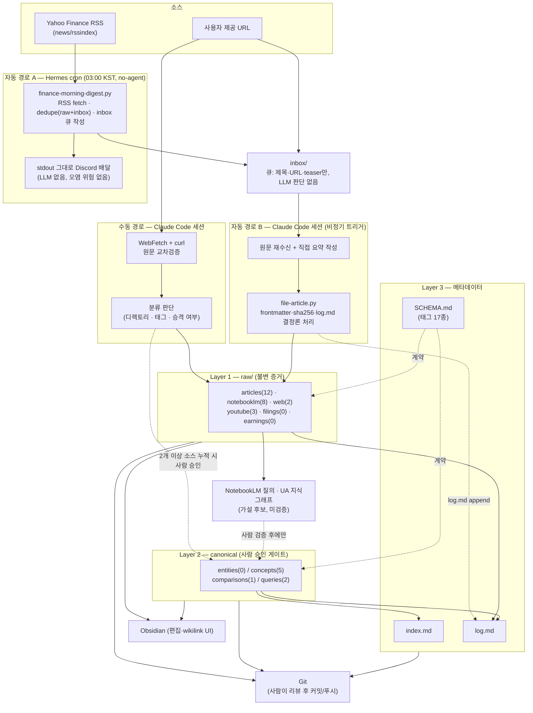

# 현재 시스템 구조도 (업데이트, 파이프라인 재설계 반영 후)

**작성일**: 2026-08-01
**작성자**: Claude Code
**목적**: `docs/dev-log/260801_01_current-system-architecture.md`에서 발견한 크론
무결성 이슈를 `docs/dev-log/260801_02_inbox-queue-pipeline-implementation.md`에서
구조적으로 해소한 뒤, 실제 반영이 끝난 현재 상태 기준으로 데이터 플로우와
시스템 구조도를 다시 기록한다. 이 문서가 2026-08-01 기준 최신 스냅샷이다.

---

## 1. `260801_01` 대비 달라진 점

| 항목 | 260801_01 (당시) | 260801_03 (현재) |
| --- | --- | --- |
| 크론 실행 모드 | LLM 에이전트(gemma4:12b)가 매 실행마다 판단 | `--no-agent` — 스크립트가 job 자체, LLM 호출 없음 |
| 크론이 쓰는 위치 | `raw/articles/`에 직접 기록 (frontmatter 누락 사고 발생) | `inbox/`에 제목·URL·teaser만 결정론적으로 큐잉 |
| raw 레코드 요약 작성자 | 로컬 12B 모델 (품질 불안정) | Claude Code가 원문을 다시 읽고 직접 작성 |
| `raw/articles/` 무결성 | 2건 frontmatter/sha256 누락 | 전건 정상 (12/12), 문제의 2건은 재작성 완료 |
| 태그 taxonomy | 16종 (finance 도메인만) | 17종 (+`personal-finance`) |
| `inbox/` 상태 | 미사용 | 큐 역할로 정식 편입, 현재 0건(전건 처리 완료) |

## 2. 현재 데이터 플로우

### 2.1 수동 경로 — Claude Code 세션 (변경 없음)

```
사용자 입력(URL 등) → inbox/ 임시 적재 → 원문 대조 검증
  → raw/<kind>/*.md 생성(frontmatter+sha256) → log.md ingest
  → (2개 이상 소스 누적 시) canonical 승격 → index.md+log.md 동기화
```

### 2.2 자동 경로 — Hermes cron, 2단계로 분리 (재설계됨)

**2단계 A — 무인 수집 (매일 03:00 KST, LLM 없음)**

```
Yahoo Finance RSS
  → finance-morning-digest.py (--no-agent, 순수 결정론적 스크립트)
      · raw/articles/ + inbox/ 기존 source 대조 → 중복 제거 (24h 컷오프)
      · 신규 기사마다 inbox/finance-<slug>.md 직접 작성
        (제목/URL/게재일/저자/캡처시각/RSS teaser/승격 명령 스니펫)
  → stdout: 신규 없으면 빈 문자열(무음 배달) / 있으면 제목+링크 목록
  → Discord로 그대로 전달 (LLM 개입 없음, 오염 위험 없음)
```

**2단계 B — 사람이 트리거하는 승격 (비정기, Claude Code 세션)**

```
inbox/finance-*.md 하나씩
  → 원문 재수신(curl/WebFetch) + Claude Code가 직접 요약 작성
  → 등록 태그 선택 (SCHEMA.md taxonomy 준수)
  → file-article.py 호출 (frontmatter·sha256·log.md 결정론 처리)
  → raw/articles/*.md 완성, inbox 항목 삭제
```

2026-08-01 오늘 이 2단계 B를 9건에 대해 실행해 검증을 마쳤다
(`docs/dev-log/260801_02` §4, log.md 2026-08-01 `update` 항목).

## 3. 시스템 구조도



## 4. 현재 상태 스냅샷 (실측, 2026-08-01)

| 구분 | 세부 | 개수 |
| --- | --- | --- |
| raw/articles | 뉴스·기사 | 12 |
| raw/notebooklm | NotebookLM 소스 | 8 |
| raw/web | 웹 캡처 | 2 |
| raw/youtube | 유튜브 캡처 | 3 |
| raw/filings, raw/earnings | 공시·실적발표 | 0 (`.gitkeep`만) |
| canonical entities/concepts/comparisons/queries | — | 0 / 5 / 1 / 2 |
| 등록 태그 | 기존 9 + finance 7 + `personal-finance` | 17 |
| `inbox/` 대기 | — | 0 |
| Hermes cron `finance-morning-digest` | 모드 | `no-agent`, `0 3 * * *`, Discord 배달 |

## 5. 남은 알려진 이슈

- 초기 수동 등록 기사 `korean-stocks-jump-record-14pct-ai-optimism.md`가
  `tags: news`를 쓰는데 `news`는 등록된 taxonomy에 없음 — `file-article.py`
  경로였다면 ERROR로 거부됐을 항목. 이번 작업 범위 밖이라 그대로 둠
  (`docs/dev-log/260801_02` §5 참고).
- Yahoo Finance RSS는 매크로/종목/실적 외에 소비자 개인재무 콘텐츠(CD·
  모기지 금리, 저축·보험 가이드 등)도 함께 반환한다 — 별도 필터링 없이
  그대로 수집하기로 결정함(`personal-finance` 태그로 구분).
- Apple 기사 등 일부는 Yahoo Finance 페이지의 JS 렌더링 제약으로 전체
  본문이 아닌 teaser(`og:description`)만 확보 가능 (`docs/dev-log/260731_05`에서
  최초 확인된 제약, 현재도 유효).

## 6. 참고

- 이전 스냅샷(이슈 발견 시점): `docs/dev-log/260801_01_current-system-architecture.md`
- 재설계 구현 기록: `docs/dev-log/260801_02_inbox-queue-pipeline-implementation.md`
- 목표/설계 아키텍처: `docs/architecture/second-brain-pkm-architecture.md`
- 자동화 최초 구축: `docs/dev-log/260731_04_hermes-finance-cron-setup.md`
- 자동화 신뢰성 수정(1차): `docs/dev-log/260731_05_finance-cron-reliability-fix.md`
- 데이터 계약: `SCHEMA.md`, `AGENTS.md`
